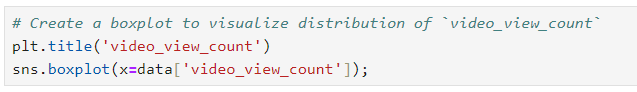

# TikTok Project

## TikTok Machine Learning Model Project

 
**Note**: _This project is created in partnership between Google Advanced Data Analytics Professional Certificate and the short-form video hosting company, TikTok. The story, all names, characters, and incidents portrayed in this project are fictitious. No identification with actual persons (living or deceased) is intended or should be inferred. And the data shared in this project has been created for pedagogical purposes._

## **Project background**

TikTok users have the ability to report videos and comments that contain user claims. These reports identify content that needs to be reviewed by moderators. This process generates a large number of user reports that are difficult to address quickly.
TikTok is working on the development of a predictive model that can determine whether a video contains a claim or offers an opinion. With a successful prediction model, TikTok can reduce the backlog of user reports and prioritize them more efficiently.

## **Scenario**
## **Step 1 - Project Proposal**
As a data analyst on TikTok's data team, with new considerations from the leadership team, my responsibility is to create a project proposal by assigning the required data analytical tasks into realistic milestones that will advise future steps in the claims classification project.
For my first assignment, I will be providing TikTok with a project proposal that will create milestones for the tasks within the comment classification project.

**Team members at TikTok**

As a new data analyst, I will be working closely with a talented team of experienced data professionals. I’ll also collaborate with TikTok co-workers outside the data team as the project requires.

**Data team roles**
-	Willow Jaffey - Data Science Lead
-	Rosie Mae Bradshaw - Data Science Manager
-	Orion Rainier - Data Scientist

**Cross-functional team members**
-	Mary Joanna Rodgers - Project Management Officer
-	Margery Adebowale - Finance Lead, Americas
-	Maika Abadi - Operations Lead

**Workflow Structure**

I will be using the PACE workflow framework throughout this project in order to provide a clear foundation and structure for this data analysis project. PACE is an acronym and each one of the letters represents an actionable stage in a project: plan, analyse, construct, and execute.

 
**Plan Stage**: First, I need to ask and answer some relevant questions for this project. These include: 
-	Who is my audience for this project? The answer to this question is necessary as it would help me identify my stakeholders for the project. My audience for this project includes my data team members, the cross-functional team members, the TikTok users who may report a claim or opinion, and the moderators who review the videos.
-	What am I trying to solve or accomplish? And what do I anticipate the impact of this work will be on the larger needs of the client? These would help me identify and be familiar with the goal of the project. I am trying to develop a predictive model capable of distinguishing whether a video contains a claim or an opinion. This aims to address the issue of the time-consuming process moderators face when evaluating each video, user comment, and content claim. By building a machine learning model that can accurately classify user interaction data, we aim to streamline and expedite the moderators' work. The anticipated impact is an improved experience for TikTok users, ensuring their claim submissions are handled promptly.
-	What questions need to be asked or answered? These include:
	-	What type of data will we be working with on this project?
 	-	What is the condition of the provided dataset? 
 	-	What variables will be the most useful? 
 	-	Are there trends within the data that can provide insight? 
 	-	What steps can I take to reduce the impact of bias?
 	-	Which team member would be assigned to which tasks?
 	-	What information will be the most useful in TikTok’s data?
 	-	What type of regression model should we use for this project?
 	-	What method of statistical testing should be used for the project?
 	-	What is the best method of hypothesis testing for this dataset?
-	What resources are required to complete this project? 
 	-	Team members
 	-	Input from stakeholders
 	-	Budget/Funding
 	-	Project Dataset
 	-	A statistical tool – e.g., Python (Python notebook)
-	What are the deliverables that will need to be created over the course of this project? 
 	-	A project proposal
 	- Prepared and cleaned datasets
 	-	Statistical model
 	-	Regression analysis model
 	-	Machine learning model
 	-	Exploratory Data Analysis reports
 	-	Stakeholder reports
 	-	Visualizations e.g. dashboard
	
 [Link to Project Proposal Doc](TikTok_project_proposal.pdf)

## **Step 2 - Data Cleaning and Organisation**
I have received notice that the project proposal submitted by the team has been approved and we have been given access to TikTok’s user data. To get clear insights, the data must be inspected, organised, and prepared to begin the process of exploratory data analysis (EDA). I will be using Python programming language for this step and all my codes will be written and executed in a Jupyter Notebook. The goal is for me to construct a dataframe in Python, perform a cursory inspection of the provided dataset, and inform the TikTok data team members of my findings. I will split this into 3 parts:

Part 1: This involves me trying to understand the situation – I will begin by exploring the dataset and reviewing the Data Dictionary.

Part 2: This involves me trying to understand the data. Here I will:
- create a pandas dataframe for data learning, future exploratory data analysis (EDA), and statistical activities.
- compile summary information about the data to inform next steps.

Part 3: This involves me trying to understand the variables. Here I will:
- use insights from my examination of the summary data to guide deeper investigation into variables.

**Imports and data loading**

I’m starting by importing the packages that I will need.

Then, loading the dataset into a dataframe. Creating a dataframe will help me conduct data manipulation, exploratory data analysis (EDA), and statistical activities.

**Understanding the data - Inspecting the data**

Now, I will view and inspect summary information about the dataframe.

The dataframe contains a collection of categorical, text, and numerical data. Each row represents a distinct TikTok video that presents either a claim or an opinion and the accompanying metadata about that video.

The dataframe contains five float64s, three int64s, and four objects. There are 19,382 observations, but some of the variables are missing values, including claim status, the video transcripton, and all of the count variables.

Many of the count variables seem to have outliers at the high end of the distribution. They have very large standard deviations and maximum values that are very high compared to their quartile values.

**Understanding the data - Investigating the variables**

In this phase, I will begin to investigate the variables more closely to better understand them.

I know from the project proposal that the ultimate objective is to use machine learning to classify videos as either claims or opinions. The first step towards understanding the data might therefore be to examine the claim_status variable. I will begin by determining how many videos there are for each different claim status.

Note: A claim refers to information that is either unsourced or from an unverified source. For example, “The news reported that someone revealed that around 50% of the mined gold on Earth comes from one source.”
Opinions refer to the personal beliefs or thoughts of a group or an individual. Here’s an example, “In my opinion the most productive workday of the week is Tuesday.”

The counts of each claim status are quite balanced.

Next, I will examine the engagement trends associated with each different claim status. I will start by using Boolean masking to filter the data according to claim status, then calculate the mean and median view counts for each claim status.

The mean and the median within each claim category are close to one another, but there is a vast discrepancy between view counts for videos labeled as claims and videos labeled as opinions.

Next, I will examine trends associated with the ban status of the author. I will use groupby() to calculate how many videos there are for each combination of categories of claim status and author ban status.

There are many more claim videos with banned authors than there are opinion videos with banned authors. This could mean a number of things, including the possibilities that:

- Claim videos are more strictly policed than opinion videos
- Authors must comply with a stricter set of rules if they post a claim than if they post an opinion
  
Also, it should be noted that there's no way of knowing if claim videos are inherently more likely than opinion videos to result in author bans, or if authors who post claim videos are more likely to post videos that violate terms of service. Finally, while I can use this data to draw conclusions about banned/active authors, I cannot draw conclusions about banned videos. There's no way of determining whether a particular video caused the ban, and banned authors could have posted videos that complied with the terms of service.

I will continue investigating engagement levels, now focusing on author_ban_status. I will calculate the median video share count of each author ban status.

Banned authors have a median share count that's 33 times the median share count of active authors! I will explore this in more depth by using groupby() to group the data by author_ban_status, then use agg() to get the count, mean, and median of each of the following columns:

- video_view_count
- video_like_count
- video_share_count

A few observations stand out:

- Banned authors and those under review get far more views, likes, and shares than active authors.
- In most groups, the mean is much greater than the median, which indicates that there are some videos with very high engagement counts.

Now, I will create three new columns to help better understand engagement rates:

- _likes_per_view_: represents the number of likes divided by the number of views for each video
- _comments_per_view_: represents the number of comments divided by the number of views for each video
- _shares_per_view_: represents the number of shares divided by the number of views for each video

I will use groupby() to compile the information in each of the three newly created columns for each combination of categories of claim status and author ban status, then use agg() to calculate the count, the mean, and the median of each group.

I know that videos by banned authors and those under review tend to get far more views, likes, and shares than videos by non-banned authors. However, when a video does get viewed, its engagement rate is less related to author ban status and more related to its claim status. Also, I know that claim videos have a higher view rate than opinion videos, but this tells me that claim videos also have a higher rate of likes on average, so they are more favorably received as well. Furthermore, they receive more engagement via comments and shares than opinion videos.

Note that for claim videos, banned authors have slightly higher likes/view and shares/view rates than active authors or those under review. However, for opinion videos, active authors and those under review both get higher engagement rates than banned authors in all categories.

Following the initial data analysis, I have summarised the key insights from the dataset as follows:

- Of the 19,382 samples in this dataset, just under 50% are claims—9,608 of them.
- Engagement level is strongly correlated with claim status. This should be a focus of further inquiry.
- Videos with banned authors have significantly higher engagement than videos with active authors. Videos with authors under review fall between these two categories in terms of engagement levels.

To effectively communicate my findings to my teammates and the Tiktok leadership team, I have prepared an executive summary. You can access the executive summary through the following link:

[Link to Executive Summary Presentation](Executive_Summary.pdf)

## **Step 3 - Exploratory Data Analysis and Data Visualisation**

It is now time to begin the exploratory data analysis (EDA) process. As a data analyst on TikTok's data team, I'll be conducting EDA for the claims classification project. I'll use Python's matplotlib and seaborn libraries to help identify outliers. To create a more polished presentation, I'll use Tableau to design visuals for an executive summary that will help non-technical stakeholders engage with and understand the data. Additionally, I will provide an executive summary of my analysis for the broader data team.

**Imports, links, and loading**

**Data exploration and cleaning**

I will start by discovering, using .head(), .size, and .shape.

Then, I will proceed to get basic information about the dataset, using .info()

I will also generate a table of descriptive statistics, using .describe().

**Data Visualisation**

Next, I will proceed to visualise the distribution of the data. The most useful visualisations for examining data distribution include box plots and histograms. Understanding the distribution will guide the next steps in the data analysis process, such as determining the appropriate modelling techniques to apply.

I will create a box plot to examine the spread of values in the 'video_duration_sec' column.

I will also create a histogram of the values in the 'video_duration_sec' column to further explore the distribution of this variable.

All videos are 5-60 seconds in length, and the distribution is uniform.

I will create a box plot to examine the spread of values in the 'video_view_count' column.

I will also create a histogram of the values in the 'video_view_count' column to further explore the distribution of this variable.

This variable has a very uneven distribution, with more than half the videos receiving fewer than 100,000 views. Distribution of view counts > 100,000 views is uniform.

I will create a box plot to examine the spread of values in the 'video_like_count' column.

I will also create a histogram of the values in the 'video_like_count' column to further explore the distribution of this variable.

Similar to view count, there are far more videos with < 100,000 likes than there are videos with more. However, in this case, there is more of a taper, as the data skews right, with many videos at the upper extremity of like count.

I will also create a box plot to examine the spread of values in the 'video_comment_count' column.

I will also create a histogram of the values in the 'video_comment_count' column to further explore the distribution of this variable.

Again, the vast majority of videos are grouped at the bottom of the range of values for video comment count. Most videos have fewer than 100 comments. The distribution is very right-skewed.

I will create a box plot to examine the spread of values in the 'video_share_count' column.

I will also create a histogram of the values in the 'video_share_count' column to further explore the distribution of this variable.

The overwhelming majority of videos had fewer than 10,000 shares. The distribution is very skewed to the right.

I will also create a box plot to examine the spread of values in the 'video_download_count' column.

I will also create a histogram of the values in the 'video_download_count' column to further explore the distribution of this variable.

The majority of videos were downloaded fewer than 500 times, but some were downloaded over 12,000 times. Again, the data is very skewed to the right.

Now, I will create a histogram with four bars: one for each combination of claim status and verification status.

There are far fewer verified users than unverified users, but if a user is verified, they are much more likely to post opinions.

Earlier, in the cleaning and organisation phase, I utilised the groupby() function to analyse the count of each claim status by author ban status. Now, I will use a histogram to convey this information visually.

For both claims and opinions, there are many more active authors than banned authors or authors under review; however, the proportion of active authors is far greater for opinion videos than for claim videos. Again, it seems that authors who post claim videos are more likely to come under review and/or get banned.

I will create a bar plot with three bars: one for each author ban status. The height of each bar would correspond with the median number of views for all videos with that author ban status.

The median view counts for non-active authors are many times greater than the median view count for active authors. Since we know that non-active authors are more likely to post claims, and that videos by non-active authors get far more views on aggregate than videos by active authors, then 'video_view_count' might be a good indicator of claim status.

Indeed, a quick check of the median view count by claim status bears out the assessment made above.

I will create a pie graph that depicts the proportions of total views for claim videos and total views for opinion videos.

The overall view count is dominated by claim videos even though there are roughly the same number of each video in the dataset.

**Determine Outliers**

When building predictive models, the presence of outliers can be problematic. For example, if I was trying to predict the view count of a particular video, videos with extremely high view counts might introduce bias to a model. Also, some outliers might indicate problems with how data was captured or recorded.

The ultimate objective of the TikTok project is to build a machine learning model that predicts whether a video is a claim or opinion. The analysis I've performed so far indicates that a video's engagement level is strongly correlated with its claim status. There's no reason to believe that any of the values in the TikTok data are erroneously captured, and they align with expectation of how social media works: a very small proportion of videos get super high engagement levels. That's the nature of viral content.

Nonetheless, it's good practice to get a sense of just how many of my data points could be considered outliers.

In this TikTok dataset, the values for the count variables are not normally distributed. They are heavily skewed to the right. One way of modifying the outlier threshold is by calculating the median value for each variable and then adding 1.5 * IQR. This results in a threshold that is, in this case, much lower than it would be if I used the 3rd quartile, as is the usual practice.

I will write a for loop that iterates over the column names of each count variable. For each iteration, I will:
- Calculate the IQR of the column
- Calculate the median of the column
- Calculate the outlier threshold (median + 1.5 * IQR)
- Calculate the number of videos with a count in that column that exceeds the outlier threshold
- Print "Number of outliers, {column name}: {outlier count}"

I will create a scatterplot of `video_view_count` versus `video_like_count` according to 'claim_status'

I will create a scatterplot of `video_view_count` versus `video_like_count` for opinions only.

