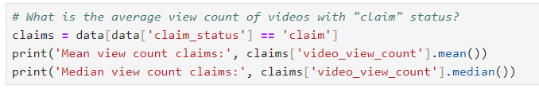
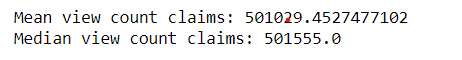

# TikTok Project

## TikTok Machine Learning Model Project

 
**Note**: _This project is created in partnership between Google Advanced Data Analytics Professional Certificate and the short-form video hosting company, TikTok. The story, all names, characters, and incidents portrayed in this project are fictitious. No identification with actual persons (living or deceased) is intended or should be inferred. And the data shared in this project has been created for pedagogical purposes._

## **Project background**

TikTok users have the ability to report videos and comments that contain user claims. These reports identify content that needs to be reviewed by moderators. This process generates a large number of user reports that are difficult to address quickly.
TikTok is working on the development of a predictive model that can determine whether a video contains a claim or offers an opinion. With a successful prediction model, TikTok can reduce the backlog of user reports and prioritize them more efficiently.

## **Scenario 1**
## **Step 1 - Project Proposal**
As a data analyst on TikTok's data team, with new considerations from the leadership team, my responsibility is to create a project proposal by assigning the required data analytical tasks into realistic milestones that will advise future steps in the claims classification project.
For my first assignment, I will be providing TikTok with a project proposal that will create milestones for the tasks within the comment classification project.

**Team members at TikTok**

As a new data analyst, I will be working closely with a talented team of experienced data professionals. I’ll also collaborate with TikTok co-workers outside the data team as the project requires.

**Data team roles**
-	Willow Jaffey - Data Science Lead
-	Rosie Mae Bradshaw - Data Science Manager
-	Orion Rainier - Data Scientist

**Cross-functional team members**
-	Mary Joanna Rodgers - Project Management Officer
-	Margery Adebowale - Finance Lead, Americas
-	Maika Abadi - Operations Lead

**Workflow Structure**

I will be using the PACE workflow framework throughout this project in order to provide a clear foundation and structure for this data analysis project. PACE is an acronym and each one of the letters represents an actionable stage in a project: plan, analyse, construct, and execute.

 
**Plan Stage**: First, I need to ask and answer some relevant questions for this project. These include: 
-	Who is my audience for this project? The answer to this question is necessary as it would help me identify my stakeholders for the project. My audience for this project includes my data team members, the cross-functional team members, the TikTok users who may report a claim or opinion, and the moderators who review the videos.
-	What am I trying to solve or accomplish? And what do I anticipate the impact of this work will be on the larger needs of the client? These would help me identify and be familiar with the goal of the project. I am trying to develop a predictive model capable of distinguishing whether a video contains a claim or an opinion. This aims to address the issue of the time-consuming process moderators face when evaluating each video, user comment, and content claim. By building a machine learning model that can accurately classify user interaction data, we aim to streamline and expedite the moderators' work. The anticipated impact is an improved experience for TikTok users, ensuring their claim submissions are handled promptly.
-	What questions need to be asked or answered? These include:
	-	What type of data will we be working with on this project?
 	-	What is the condition of the provided dataset? 
 	-	What variables will be the most useful? 
 	-	Are there trends within the data that can provide insight? 
 	-	What steps can I take to reduce the impact of bias?
 	-	Which team member would be assigned to which tasks?
 	-	What information will be the most useful in TikTok’s data?
 	-	What type of regression model should we use for this project?
 	-	What method of statistical testing should be used for the project?
 	-	What is the best method of hypothesis testing for this dataset?
-	What resources are required to complete this project? 
 	-	Team members
 	-	Input from stakeholders
 	-	Budget/Funding
 	-	Project Dataset
 	-	A statistical tool – e.g., Python (Python notebook)
-	What are the deliverables that will need to be created over the course of this project? 
 	-	A project proposal
 	- Prepared and cleaned datasets
 	-	Statistical model
 	-	Regression analysis model
 	-	Machine learning model
 	-	Exploratory Data Analysis reports
 	-	Stakeholder reports
 	-	Visualizations e.g. dashboard
	
 [Link to Project Proposal Doc](TikTok_project_proposal.pdf)

## **Step 2 - Data Cleaning and Organisation**
I have received notice that the project proposal submitted by the team has been approved and we have been given access to TikTok’s user data. To get clear insights, the data must be inspected, organised, and prepared to begin the process of exploratory data analysis (EDA). I will be using Python programming language for this step and all my codes will be written and executed in a Jupyter Notebook. The goal is for me to construct a dataframe in Python, perform a cursory inspection of the provided dataset, and inform the TikTok data team members of my findings. I will split this into 3 parts:

Part 1: This involves me trying to understand the situation – I will begin by exploring the dataset and reviewing the Data Dictionary.

Part 2: This involves me trying to understand the data. Here I will:
- create a pandas dataframe for data learning, future exploratory data analysis (EDA), and statistical activities.
- compile summary information about the data to inform next steps.

Part 3: This involves me trying to understand the variables. Here I will:
- use insights from my examination of the summary data to guide deeper investigation into variables.

**Imports and data loading**

I’m starting by importing the packages that I will need.

Then, loading the dataset into a dataframe. Creating a dataframe will help me conduct data manipulation, exploratory data analysis (EDA), and statistical activities.

Now, I will view and inspect summary information about the dataframe.

The dataframe contains a collection of categorical, text, and numerical data. Each row represents a distinct TikTok video that presents either a claim or an opinion and the accompanying metadata about that video.

The dataframe contains five float64s, three int64s, and four objects. There are 19,382 observations, but some of the variables are missing values, including claim status, the video transcripton, and all of the count variables.

Many of the count variables seem to have outliers at the high end of the distribution. They have very large standard deviations and maximum values that are very high compared to their quartile values.

**Understanding the data - Investigating the variables**

In this phase, I will begin to investigate the variables more closely to better understand them.

I know from the project proposal that the ultimate objective is to use machine learning to classify videos as either claims or opinions. The first step towards understanding the data might therefore be to examine the claim_status variable. I will begin by determining how many videos there are for each different claim status.

Note: A claim refers to information that is either unsourced or from an unverified source. For example, “The news reported that someone revealed that around 50% of the mined gold on Earth comes from one source.”
Opinions refer to the personal beliefs or thoughts of a group or an individual. Here’s an example, “In my opinion the most productive workday of the week is Tuesday.”

The counts of each claim status are quite balanced.

Next, I will examine the engagement trends associated with each different claim status. I will start by using Boolean masking to filter the data according to claim status, then calculate the mean and median view counts for each claim status.

The mean and the median within each claim category are close to one another, but there is a vast discrepancy between view counts for videos labeled as claims and videos labeled as opinions.

Next, I will examine trends associated with the ban status of the author. I will use groupby() to calculate how many videos there are for each combination of categories of claim status and author ban status.
