# TikTok Project

## TikTok Machine Learning Model Project

 
**Note**: _This project is created in partnership between Google Advanced Data Analytics Professional Certificate and the short-form video hosting company, TikTok. The story, all names, characters, and incidents portrayed in this project are fictitious. No identification with actual persons (living or deceased) is intended or should be inferred. And the data shared in this project has been created for pedagogical purposes._

## **Project background**

TikTok users have the ability to report videos and comments that contain user claims. These reports identify content that needs to be reviewed by moderators. This process generates a large number of user reports that are difficult to address quickly.
TikTok is working on the development of a predictive model that can determine whether a video contains a claim or offers an opinion. With a successful prediction model, TikTok can reduce the backlog of user reports and prioritize them more efficiently.

## **Scenario**
## **Step 1 - Project Proposal**
As a data analyst on TikTok's data team, with new considerations from the leadership team, my responsibility is to create a project proposal by assigning the required data analytical tasks into realistic milestones that will advise future steps in the claims classification project.
For my first assignment, I will be providing TikTok with a project proposal that will create milestones for the tasks within the comment classification project.

**Team members at TikTok**

As a new data analyst, I will be working closely with a talented team of experienced data professionals. I’ll also collaborate with TikTok co-workers outside the data team as the project requires.

**Data team roles**
-	Willow Jaffey - Data Science Lead
-	Rosie Mae Bradshaw - Data Science Manager
-	Orion Rainier - Data Scientist

**Cross-functional team members**
-	Mary Joanna Rodgers - Project Management Officer
-	Margery Adebowale - Finance Lead, Americas
-	Maika Abadi - Operations Lead

**Workflow Structure**

I will be using the PACE workflow framework throughout this project in order to provide a clear foundation and structure for this data analysis project. PACE is an acronym and each one of the letters represents an actionable stage in a project: plan, analyse, construct, and execute.

 
**Plan Stage**: First, I need to ask and answer some relevant questions for this project. These include: 
-	Who is my audience for this project? The answer to this question is necessary as it would help me identify my stakeholders for the project. My audience for this project includes my data team members, the cross-functional team members, the TikTok users who may report a claim or opinion, and the moderators who review the videos.
-	What am I trying to solve or accomplish? And what do I anticipate the impact of this work will be on the larger needs of the client? These would help me identify and be familiar with the goal of the project. I am trying to develop a predictive model capable of distinguishing whether a video contains a claim or an opinion. This aims to address the issue of the time-consuming process moderators face when evaluating each video, user comment, and content claim. By building a machine learning model that can accurately classify user interaction data, we aim to streamline and expedite the moderators' work. The anticipated impact is an improved experience for TikTok users, ensuring their claim submissions are handled promptly.
-	What questions need to be asked or answered? These include:
	-	What type of data will we be working with on this project?
 	-	What is the condition of the provided dataset? 
 	-	What variables will be the most useful? 
 	-	Are there trends within the data that can provide insight? 
 	-	What steps can I take to reduce the impact of bias?
 	-	Which team member would be assigned to which tasks?
 	-	What information will be the most useful in TikTok’s data?
 	-	What type of regression model should we use for this project?
 	-	What method of statistical testing should be used for the project?
 	-	What is the best method of hypothesis testing for this dataset?
-	What resources are required to complete this project? 
 	-	Team members
 	-	Input from stakeholders
 	-	Budget/Funding
 	-	Project Dataset
 	-	A statistical tool – e.g., Python (Python notebook)
-	What are the deliverables that will need to be created over the course of this project? 
 	-	A project proposal
 	- Prepared and cleaned datasets
 	-	Statistical model
 	-	Regression analysis model
 	-	Machine learning model
 	-	Exploratory Data Analysis reports
 	-	Stakeholder reports
 	-	Visualizations e.g. dashboard
	
 [Link to Project Proposal Doc](TikTok_project_proposal.pdf)

## **Step 2 - Data Cleaning and Organisation**
I have received notice that the project proposal submitted by the team has been approved and we have been given access to TikTok’s user data. To get clear insights, the data must be inspected, organised, and prepared to begin the process of exploratory data analysis (EDA). I will be using Python programming language for this step and all my codes will be written and executed in a Jupyter Notebook. The goal is for me to construct a dataframe in Python, perform a cursory inspection of the provided dataset, and inform the TikTok data team members of my findings. I will split this into 3 parts:

Part 1: This involves me trying to understand the situation – I will begin by exploring the dataset and reviewing the Data Dictionary.

Part 2: This involves me trying to understand the data. Here I will:
- create a pandas dataframe for data learning, future exploratory data analysis (EDA), and statistical activities.
- compile summary information about the data to inform next steps.

Part 3: This involves me trying to understand the variables. Here I will:
- use insights from my examination of the summary data to guide deeper investigation into variables.

**Imports and data loading**

I’m starting by importing the packages that I will need.

Then, loading the dataset into a dataframe. Creating a dataframe will help me conduct data manipulation, exploratory data analysis (EDA), and statistical activities.

**Understanding the data - Inspecting the data**

Now, I will view and inspect summary information about the dataframe.

The dataframe contains a collection of categorical, text, and numerical data. Each row represents a distinct TikTok video that presents either a claim or an opinion and the accompanying metadata about that video.

The dataframe contains five float64s, three int64s, and four objects. There are 19,382 observations, but some of the variables are missing values, including claim status, the video transcripton, and all of the count variables.

Many of the count variables seem to have outliers at the high end of the distribution. They have very large standard deviations and maximum values that are very high compared to their quartile values.

**Understanding the data - Investigating the variables**

In this phase, I will begin to investigate the variables more closely to better understand them.

I know from the project proposal that the ultimate objective is to use machine learning to classify videos as either claims or opinions. The first step towards understanding the data might therefore be to examine the claim_status variable. I will begin by determining how many videos there are for each different claim status.

Note: A claim refers to information that is either unsourced or from an unverified source. For example, “The news reported that someone revealed that around 50% of the mined gold on Earth comes from one source.”
Opinions refer to the personal beliefs or thoughts of a group or an individual. Here’s an example, “In my opinion the most productive workday of the week is Tuesday.”

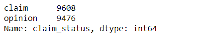

The counts of each claim status are quite balanced.

Next, I will examine the engagement trends associated with each different claim status. I will start by using Boolean masking to filter the data according to claim status, then calculate the mean and median view counts for each claim status.

The mean and the median within each claim category are close to one another, but there is a vast discrepancy between view counts for videos labeled as claims and videos labeled as opinions.

Next, I will examine trends associated with the ban status of the author. I will use groupby() to calculate how many videos there are for each combination of categories of claim status and author ban status.

There are many more claim videos with banned authors than there are opinion videos with banned authors. This could mean a number of things, including the possibilities that:

- Claim videos are more strictly policed than opinion videos
- Authors must comply with a stricter set of rules if they post a claim than if they post an opinion
  
Also, it should be noted that there's no way of knowing if claim videos are inherently more likely than opinion videos to result in author bans, or if authors who post claim videos are more likely to post videos that violate terms of service. Finally, while I can use this data to draw conclusions about banned/active authors, I cannot draw conclusions about banned videos. There's no way of determining whether a particular video caused the ban, and banned authors could have posted videos that complied with the terms of service.

I will continue investigating engagement levels, now focusing on author_ban_status. I will calculate the median video share count of each author ban status.

Banned authors have a median share count that's 33 times the median share count of active authors! I will explore this in more depth by using groupby() to group the data by author_ban_status, then use agg() to get the count, mean, and median of each of the following columns:

- video_view_count
- video_like_count
- video_share_count

A few observations stand out:

- Banned authors and those under review get far more views, likes, and shares than active authors.
- In most groups, the mean is much greater than the median, which indicates that there are some videos with very high engagement counts.

Now, I will create three new columns to help better understand engagement rates:

- _likes_per_view_: represents the number of likes divided by the number of views for each video
- _comments_per_view_: represents the number of comments divided by the number of views for each video
- _shares_per_view_: represents the number of shares divided by the number of views for each video

I will use groupby() to compile the information in each of the three newly created columns for each combination of categories of claim status and author ban status, then use agg() to calculate the count, the mean, and the median of each group.

I know that videos by banned authors and those under review tend to get far more views, likes, and shares than videos by non-banned authors. However, when a video does get viewed, its engagement rate is less related to author ban status and more related to its claim status. Also, I know that claim videos have a higher view rate than opinion videos, but this tells me that claim videos also have a higher rate of likes on average, so they are more favorably received as well. Furthermore, they receive more engagement via comments and shares than opinion videos.

Note that for claim videos, banned authors have slightly higher likes/view and shares/view rates than active authors or those under review. However, for opinion videos, active authors and those under review both get higher engagement rates than banned authors in all categories.

Following the initial data analysis, I have summarised the key insights from the dataset as follows:

- Of the 19,382 samples in this dataset, just under 50% are claims—9,608 of them.
- Engagement level is strongly correlated with claim status. This should be a focus of further inquiry.
- Videos with banned authors have significantly higher engagement than videos with active authors. Videos with authors under review fall between these two categories in terms of engagement levels.

To effectively communicate my findings to my teammates and the Tiktok leadership team, I have prepared an executive summary. You can access the executive summary through the following link:

[Link to Executive Summary Presentation](Executive_Summary.pdf)

## **Step 3 - Exploratory Data Analysis and Data Visualisation**

It is now time to begin the exploratory data analysis (EDA) process. As a data analyst on TikTok's data team, I'll be conducting EDA for the claims classification project. I'll use Python's matplotlib and seaborn libraries to help identify outliers. Additionally, I will provide an executive summary of my analysis for the broader data team.

**Imports, links, and loading**

**Data exploration and cleaning**

I will start by discovering, using .head(), .size, and .shape.

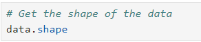

Then, I will proceed to get basic information about the dataset, using .info()

I will also generate a table of descriptive statistics, using .describe().

**Data Visualisation**

Next, I will proceed to visualise the distribution of the data. The most useful visualisations for examining data distribution include box plots and histograms. Understanding the distribution will guide the next steps in the data analysis process, such as determining the appropriate modelling techniques to apply.

I will create a box plot to examine the spread of values in the 'video_duration_sec' column.

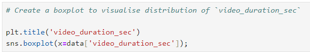

I will also create a histogram of the values in the 'video_duration_sec' column to further explore the distribution of this variable.

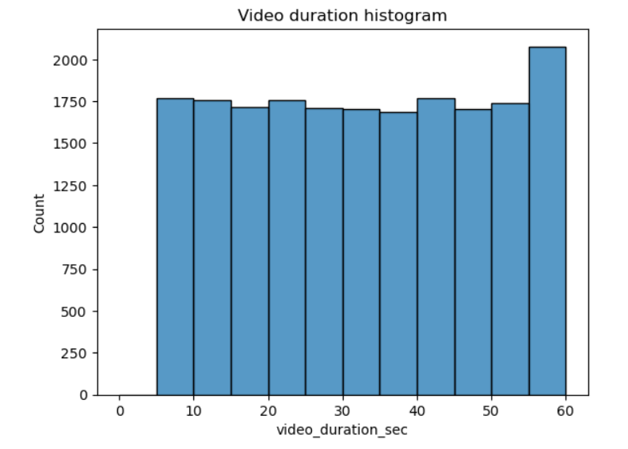

All videos are 5-60 seconds in length, and the distribution is uniform.

I will create a box plot to examine the spread of values in the 'video_view_count' column.

I will also create a histogram of the values in the 'video_view_count' column to further explore the distribution of this variable.

This variable has a very uneven distribution, with more than half the videos receiving fewer than 100,000 views. Distribution of view counts > 100,000 views is uniform.

I will create a box plot to examine the spread of values in the 'video_like_count' column.

I will also create a histogram of the values in the 'video_like_count' column to further explore the distribution of this variable.

Similar to view count, there are far more videos with < 100,000 likes than there are videos with more. However, in this case, there is more of a taper, as the data skews right, with many videos at the upper extremity of like count.

I will also create a box plot to examine the spread of values in the 'video_comment_count' column.

I will also create a histogram of the values in the 'video_comment_count' column to further explore the distribution of this variable.

Again, the vast majority of videos are grouped at the bottom of the range of values for video comment count. Most videos have fewer than 100 comments. The distribution is very right-skewed.

I will create a box plot to examine the spread of values in the 'video_share_count' column.

I will also create a histogram of the values in the 'video_share_count' column to further explore the distribution of this variable.

The overwhelming majority of videos had fewer than 10,000 shares. The distribution is very skewed to the right.

I will also create a box plot to examine the spread of values in the 'video_download_count' column.

I will also create a histogram of the values in the 'video_download_count' column to further explore the distribution of this variable.

The majority of videos were downloaded fewer than 500 times, but some were downloaded over 12,000 times. Again, the data is very skewed to the right.

Now, I will create a histogram with four bars: one for each combination of claim status and verification status.

There are far fewer verified users than unverified users, but if a user is verified, they are much more likely to post opinions.

Earlier, in the cleaning and organisation phase, I utilised the groupby() function to analyse the count of each claim status by author ban status. Now, I will use a histogram to convey this information visually.

For both claims and opinions, there are many more active authors than banned authors or authors under review; however, the proportion of active authors is far greater for opinion videos than for claim videos. Again, it seems that authors who post claim videos are more likely to come under review and/or get banned.

I will create a bar plot with three bars: one for each author ban status. The height of each bar would correspond with the median number of views for all videos with that author ban status.

The median view counts for non-active authors are many times greater than the median view count for active authors. Since we know that non-active authors are more likely to post claims, and that videos by non-active authors get far more views on aggregate than videos by active authors, then 'video_view_count' might be a good indicator of claim status.

Indeed, a quick check of the median view count by claim status bears out the assessment made above.

I will create a pie graph that depicts the proportions of total views for claim videos and total views for opinion videos.

The overall view count is dominated by claim videos even though there are roughly the same number of each video in the dataset.

**Determine Outliers**

When building predictive models, the presence of outliers can be problematic. For example, if I was trying to predict the view count of a particular video, videos with extremely high view counts might introduce bias to a model. Also, some outliers might indicate problems with how data was captured or recorded.

The ultimate objective of the TikTok project is to build a machine learning model that predicts whether a video is a claim or opinion. The analysis I've performed so far indicates that a video's engagement level is strongly correlated with its claim status. There's no reason to believe that any of the values in the TikTok data are erroneously captured, and they align with expectation of how social media works: a very small proportion of videos get super high engagement levels. That's the nature of viral content.

Nonetheless, it's good practice to get a sense of just how many of my data points could be considered outliers.

In this TikTok dataset, the values for the count variables are not normally distributed. They are heavily skewed to the right. One way of modifying the outlier threshold is by calculating the median value for each variable and then adding 1.5 * IQR. This results in a threshold that is, in this case, much lower than it would be if I used the 3rd quartile, as is the usual practice.

I will write a for loop that iterates over the column names of each count variable. For each iteration, I will:
- Calculate the IQR of the column
- Calculate the median of the column
- Calculate the outlier threshold (median + 1.5 * IQR)
- Calculate the number of videos with a count in that column that exceeds the outlier threshold
- Print "Number of outliers, {column name}: {outlier count}"

I will create a scatterplot of `video_view_count` versus `video_like_count` according to 'claim_status'

I will create a scatterplot of `video_view_count` versus `video_like_count` for opinions only.

The Exploratory Data Analysis (EDA) process is now complete. I have thoroughly examined the data distribution, frequency counts, mean and median values, extreme values/outliers, and addressed any missing data. Additionally, I have analysed correlations between variables, with a particular focus on the relationship between the claim_status variable and others. Below is the link to the executive summary I have provided for the leadership team.

[Link to Executive Summary Presentation](Executive_Summary_2.pdf)

## **Step 4 - Data Exploration and Hypothesis Testing**

The project is now reaching its midpoint. So far, I have completed a project proposal and used Python to perform exploratory data analysis on the dataset for the claims classification project. Additionally, I’ve created data visualisations and executive summaries to present to stakeholders. The next step involves applying statistical methods to analyse and interpret the claims classification data. Recently, I received an email from Mary Joanna Rodgers, a project management officer at TikTok, informing me of a new request from the leadership team. They want to determine whether there is a statistically significant difference in the number of views between TikTok videos posted by verified and unverified accounts. After consulting with my data science manager, Rosie Mae Bradshaw, she suggested that I conduct hypothesis testing on the claims classification data. I’ve been tasked with investigating the user claim dataset to identify the most suitable hypothesis testing method for this project.

I am going to divide my tasks into 3 parts to help guide me.

**Part 1: Imports, Data Loading and Data Exploration**

- What data packages will be necessary for hypothesis testing?
- How will descriptive statistics help me analyse the data?

**Part 2: Conduct hypothesis testing**

- How will I formulate my null hypothesis and alternative hypothesis?

**Part 3: Communicate insights with stakeholders**

- What key business insight(s) emerge from my hypothesis test?
- What business recommendations do I propose based on my results?

### **Part 1: Imports, Data Loading and Data Exploration**

I will now import packages and libraries needed to compute descriptive statistics and conduct a hypothesis test.

Then, I will use descriptive statistics to conduct Exploratory Data Analysis (EDA).

Since I am interested in the relationship between "verified_status" and "video_view_count", one way to approach this is to examine the mean values of "video_view_count" for each group of verified_status in the sample data, as I have done below:

### **Part 2: Conduct hypothesis testing**

My goal in this step is to conduct a two-sample t-test. I will use the following steps for conducting a hypothesis test in doing this:

- State the null hypothesis and the alternative hypothesis
- Choose a significance level
- Find the p-value
- Reject or fail to reject the null hypothesis

**State the null hypothesis and the alternative hypothesis**
- **Null hypothesis H0**: There is no difference in number of views between TikTok videos posted by verified accounts and TikTok videos posted by unverified accounts (any observed difference in the sample data is due to chance or sampling variability).

- **Alternative hypothesis HA**: There is a difference in number of views between TikTok videos posted by verified accounts and TikTok videos posted by unverified accounts (any observed difference in the sample data is due to an actual difference in the corresponding population means).

**Choose a significance level**

I am choosing 5% as the significance level and I will proceed with a two-sample t-test.

**Find the p-value**

**Reject or fail to reject the null hypothesis**

Since the p-value is extremely small (pvalue=2.6088823687177823e-120 much smaller than the significance level of 5%), I'll reject the null hypothesis. My conclusiom is that there is a statistically significant difference in the mean video view count between verified and unverified accounts on TikTok.

### **Part 3: Communicate insights with stakeholders**

The analysis shows that there is a statistically significant difference in the average view counts between videos from verified accounts and videos from unverified accounts. This suggests there might be fundamental behavioural differences between these two groups of accounts.

It would be interesting to investigate the root cause of this behavioural difference. For example, do unverified accounts tend to post more clickbait-y videos? Or are unverified accounts associated with spam bots that help inflate view counts?

The next step will be to build a regression model on verified_status. A regression model is the natural next step because the end goal is to make predictions on claim status. A regression model for verified_status can help analyse user behaviour in this group of verified users. Technical note to prepare regression model: because the data is skewed, and there is a significant difference in account types, it will be key to build a logistic regression model.

I have created an executive summary to effectively communicate my results to the leadership team. Below is the link to the executive summary I have provided for the leadership team.

[Link to Executive Summary Presentation](Executive_Summary_3.pdf)

## **Step 5 - Regression modeling**

We are now more than halfway through the claims classification project. The TikTok team has reviewed the results of our hypothesis testing, and Maika Abadi, TikTok's Operations Lead, has expressed interest in understanding how various factors are associated with a user's verified status. Previously, the data team observed that verified users are significantly more likely to post opinions. As a result, the team has shifted focus to predicting verified status to better understand the relationship between video characteristics and verified users. I have been tasked with conducting a logistic regression using _"verified_status"_ as the outcome variable. The findings from this analysis may help inform the final model for distinguishing between claim and opinion posts.

I will begin by breaking down my tasks into manageable chunks such as:

- Task 1: Imports and Loading
- Task 2a: Explore Data with EDA
- Task 2b: Examine Correlations
- Task 3a: Select Variables
- Task 3b: Train-Test Split
- Task 3c: Encode Variables
- Task 3d: Model Building
- Task 4a: Results and Evaluation
- Task 4b: Visualise Model Results
- Task 4c: Interpret Model Coefficients
- Task 4d: Conclusion

### **Task 1: Imports and Loading**

I will start by importing the data and packages that are needed for building regression models.

Now, I'll load the dataset

### **Task 2a: Explore Data with EDA**

Next, I'll analyse the data and check for and handle missing values and duplicates.

I'll start by inspecting the first five rows of the dataframe.

Now, I'll get the number of rows and columns in the dataset.

and then, get the data types of the columns.

Moving on, I'll get basic information about the dataset.

then, generate basic descriptive statistics about the dataset.

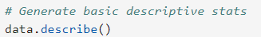

and then check for and handle missing values.

I will also check for and handle duplicates.

**Note:** There does not seem to be any duplicates.

and then, check for and handle outliers.

Next, I'll check class balance.

Approximately 94.2% of the dataset represents videos posted by unverified accounts and 5.8% represents videos posted by verified accounts. So, the outcome variable is not very balanced.

Next, I'll use resampling to create class balance in the outcome variable.

and then, I'll get the average _"video_transcription_text"_ length for videos posted by verified accounts and the average _"video_transcription_text"_ length for videos posted by unverified accounts.

and, extract the length of each _"video_transcription_text"_ and add this as a column to the dataframe, so that it can be used as a potential feature in the model.

Now, I'm going to visualize the distribution of _"video_transcription_text"_ length for videos posted by verified accounts and videos posted by unverified accounts.

### **Task 2b: Examine correlations**

Next, I will code a correlation matrix to help determine most correlated variables.

Now, I'll visualise a correlation heatmap of the data.

One of the model assumptions for logistic regression is no severe multicollinearity among the features. I will take this into consideration as I examine the heatmap and choose which features to proceed with.

The heatmap shows that the following pair of variables are strongly correlated: _"video_view_count"_ and _"video_like_count"_ (0.86 correlation coefficient). To build a logistic regression model that meets the no multicollinearity assumption, I would exclude _"video_like_count"_. And among the variables that quantify video metrics, I would keep _"video_view_count"_, _"video_share_count"_, _"video_download_count"_, and _"video_comment_count"_ as features.

### **Task 3a: Select variables**

First, I'll set my Y and X variables.

then, select the features.

I did not select the _"#"_ and _"video_id"_ columns as features, because they do not seem to be helpful for predicting whether a video presents a claim or an opinion. Also, _"video_like_count"_ is not selected as a feature, because it is strongly correlated with other features, as discussed earlier. And logistic regression has a no multicollinearity model assumption that needs to be met.

### **Task 3b: Train-Test Split**

I'll split the data into training and testing sets.

Then, I'll confirm that the dimensions of the training and testing sets are in alignment.

- The number of features (7) aligns between the training and testing sets.
- The number of rows aligns between the features and the outcome variable for training (26826) and testing (8942).

### **Task 3c: Encode variables**

I'll check the data types of the features.

As shown above, the _"claim_status"_ and _"author_ban_status"_ features are each of data type object currently. In order to work with the implementations of models through sklearn, these categorical features will need to be made numeric. One way to do this is through one-hot encoding.

Now, I'll check the data type of the outcome variable.

As shown above, the outcome variable is of data type object currently. One-hot encoding can be used to make this variable numeric.

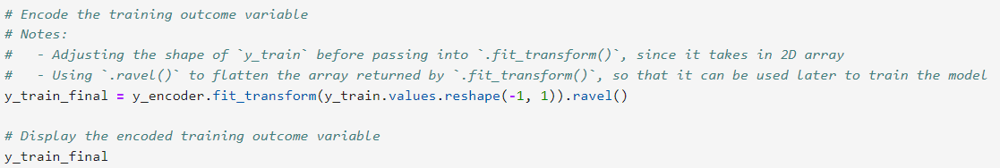

### **Task 3d: Model Building**

Here, I will construct a model and fit it to the training set.

### **Task 4a: Results and Evaluation**

To evaluate the model, I'll start by encoding categorical features in the testing set using an appropriate method.

Then I'll test the logistic regression model by using it to make predictions on the encoded testing set.

Then, I'll display the predictions on the encoded testing set.

and now, display the true labels of the testing set.

Then, I'll encode the true labels of the testing set so it can be compared to the predictions.

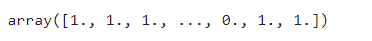

And then, I'll confirm again that the dimensions of the training and testing sets are in alignment since additional features were added.

- The number of features (8) aligns between the training and testing sets.
- The number of rows aligns between the features and the outcome variable for training (26826) and testing (8942).

### **Task 4b: Visualise Model Results**

I will create a confusion matrix to visualise the results of the logistic regression model.

**The upper-left quadrant displays the number of true negatives:** the number of videos posted by unverified accounts that the model accurately classified as so.

**The upper-right quadrant displays the number of false positives:** the number of videos posted by unverified accounts that the model misclassified as posted by verified accounts.

**The lower-left quadrant displays the number of false negatives:** the number of videos posted by verified accounts that the model misclassified as posted by unverified accounts.

**The lower-right quadrant displays the number of true positives:** the number of videos posted by verified accounts that the model accurately classified as so.

A perfect model would yield all true negatives and true positives, and no false negatives or false positives.

Now, I'll create a classification report that includes precision, recall, f1-score, and accuracy metrics to evaluate the performance of the logistic regression model.

The classification report shows that the logistic regression model achieved a precision of 61% and a recall of 84%, and it achieved an accuracy of 65%. Note that the precision and recall scores are taken from the "not verified" row of the output because that is the target class that we are most interested in predicting. The "verified" class has its own precision/recall metrics, and the weighted average represents the combined metrics for both classes of the target variable.

### **Task 4c: Interpret Model Coefficients**

### **Task 4d: Conclusion**

1. What are the key takeaways from this project?
2. What results can be presented from this project?

**Key takeaways:**

- The dataset has a few strongly correlated variables, which might lead to multicollinearity issues when fitting a logistic regression model. Hence, I decided to drop *video_like_count* from the model building.
- Based on the logistic regression model, each additional second of the video is associated with a 0.009 increase in the log-odds of the user having a verified status.
- The logistic regression model had not great, but acceptable predictive power: a precision of 61% is less than ideal, but a recall of 84% is very good. Overall accuracy is towards the lower end of what would typically be considered acceptable.

**Results:**

I developed a logistic regression model for verified status based on video features. The model had decent predictive power. Based on the estimated model coefficients from the logistic regression, longer videos tend to be associated with higher odds of the user being verified. Other video features have small estimated coefficients in the model, so their association with verified status seems to be small.

I have also created an executive summary to effectively communicate my results to the leadership team. Below is the link to the executive summary I have provided for the leadership team.

[Link to Executive Summary Presentation](Executive_Summary_4.pdf)

## **Step 6 - Classifying Videos Using Machine Learning**

My supervisor was impressed with the work I have done and has requested that I build a machine learning model that can be used to determine whether a video contains a claim or whether it offers an opinion. With a successful prediction model, TikTok can reduce the backlog of user reports and prioritise them more efficiently.

TikTok users can report videos that they believe violate the platform's terms of service. Because there are millions of TikTok videos created and viewed every day, this means that many videos get reported — too many to be individually reviewed by a human moderator.

Analysis indicates that when authors do violate the terms of service, they're much more likely to be presenting a claim than an opinion. Therefore, it is useful to be able to determine which videos make claims and which videos are opinions.

TikTok wants to build a machine learning model to help identify claims and opinions. Videos that are labeled opinions will be less likely to go on to be reviewed by a human moderator. Videos that are labeled as claims will be further sorted by a downstream process to determine whether they should get prioritised for review. For example, perhaps videos that are classified as claims would then be ranked by how many times they were reported, then the top x% would be reviewed by a human each day.

A machine learning model would greatly assist in the effort to present human moderators with videos that are most likely to be in violation of TikTok's terms of service.

**_Note:_** The data dictionary shows that there is a column called 'claim_status'. This is a binary value that indicates whether a video is a claim or an opinion. This will be the target variable. In other words, for each video, the model should predict whether the video is a claim or an opinion.

This is a classification task because the model is predicting a binary class.

**To select an evaluation metric**

To determine which evaluation metric might be best, I'm going to consider how the model might be wrong. There are two possibilities for bad predictions:

- **_False positives_**: When the model predicts a video is a claim when in fact it is an opinion
- **_False negatives_**: When the model predicts a video is an opinion when in fact it is a claim

**What are the ethical implications of building the model?**

It is better for the model to predict false positives when it makes a mistake, and worse for it to predict false negatives. It's very important to identify videos that break the terms of service, even if that means some opinion videos are misclassified as claims. The worst case for an opinion misclassified as a claim is that the video goes to human review. The worst case for a claim that's misclassified as an opinion is that the video does not get reviewed and it violates the terms of service. A video that violates the terms of service would be considered posted from a "banned" author, as referenced in the data dictionary.

Because it's more important to minimise false negatives, the model evaluation metric will be **recall**.

**Modeling workflow and model selection process**

Previous work with this data has revealed that there are ~20,000 videos in the sample. This is sufficient to conduct a rigorous model validation workflow, broken into the following steps:

- Split the data into train/validation/test sets (60/20/20)
- Fit models and tune hyperparameters on the training set
- Perform final model selection on the validation set
- Assess the champion model's performance on the test set

I will begin by breaking down my tasks into manageable chunks such as:

- Task 1: Imports and loading
- Task 2: Examine data, summary info, and descriptive stats
- Task 3: Feature engineering
- Task 4: Split the data
- Task 5: Create train/validate/test sets
- Task 6: Tokenize text column
- Task 7: Build models
- Task 8: Evaluate models

### **Task 1: Imports and Loading**

I'll start by importing packages needed to build machine learning models to achieve the goal of this project.

Now, I'll load the dataset.

### **Task 2: Examine Data, Summary Info, and Descriptive Stats**

Here, I'll inspect the first five rows of the dataframe.

Then, I'll get the number of rows and columns in the dataset.

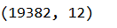

And then, I'll get basic information about the dataset.

Then, generate basic descriptive statistics about the dataset.

Then, I'll check for and handle missing values.

Since there are very few missing values relative to the number of samples in the dataset, I'll drop observations with missing values.

Then, I'll check for and handle duplicates.

There are no duplicate observations in the data.

The next step is to examine and address outliers. However, since tree-based models are robust to outliers, there is no need to impute or remove any values based on their position within the distribution.

Now, I'll check class balance

Approximately 50.3% of the dataset represents claims and 49.7% represents opinions, so the outcome variable is balanced.

### **Task 3: Feature Engineering**

**Feature Extraction**

I would extract the length (character count) of each "video_transcription_text" and add this to the dataframe as a new column called "text_length" so that it can be used as a feature in the model.

Then, I would calculate the average "text_length" for claims and opinions.

To visualise the distribution of "text_length" for claims and opinions using a histogram:

Letter count distributions for both claims and opinions are approximately normal with a slight right skew. Claim videos tend to have more characters - about 13 more on average, as indicated above.

**Feature Selection and Transformation**

Next, I will select and encode target and catgorical variables.

### **Task 4: Split the Data**

Here, I will assign target variable.

In this case, the target variable is "claim_status".

- 0 represents an opinion
- 1 represents a claim

Then, I would isolate the features.

### **Task 5: Create Train/Validate/Test sets**

Here, I'll split data into training and testing sets, 80/20.

Then, split the training set into training and validation sets, 75/25, to result in a final ratio of 60/20/20 for train/validate/test sets.

And then, confirm that the dimensions of the training, validation, and testing sets are in alignment.

- The number of features (11) aligns between the training and testing sets.
- The number of rows aligns between the features and the outcome variable for training (11,450) and both validation and testing data (3,817).

### **Task 6: Tokenise Text Column**

The feature "video_transcription_text" is text-based. It is not a categorical variable, since it does not have a fixed number of possible values. One way to extract numerical features from it is through a bag-of-words algorithm like CountVectorizer.

Now, I'll fit the vectoriser to the training data (generate the n-grams) and transform it (tally the occurrences).

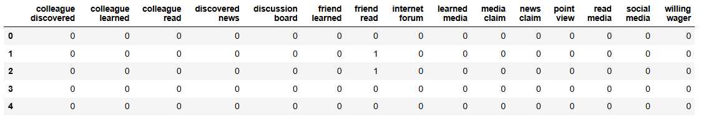

Next, I will extract n-gram counts for the validation data. The vectoriser will not be refit to the validation data but will only transform it. In other words, the video transcriptions in the validation data will be assessed using the n-grams identified in the training data.

I will repeat the process to extract n-gram counts for the test data. As before, the vectoriser will not be refit to the test data but will only transform it.

### **Task 7: Build Models**

**Build a Random Forest Model**

Here, I will fit a random forest model to the training set, use cross-validation to tune the hyperparameters and select the model that performs best on recall.

This model performs exceptionally well, with an average recall score of 0.995 across the five cross-validation folds. After checking the precision score to be sure the model is not classifying all samples as claims, it is clear that this model is making almost perfect classifications.

**Build an XGBoost Model**

This model also performs exceptionally well. Although its recall score is very slightly lower than the random forest model's, its precision score is perfect.

### **Task 8: Evaluate Models**

Here, I will evaluate models against validation data.

**Random Forest**

To display the predictions on the validation set:

To display the true labels of the validation set:

I'll create a confusion matrix to visualise the results of the classification model.

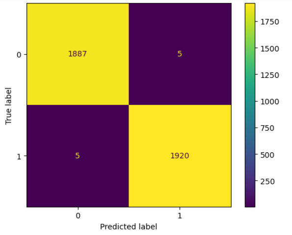

- The upper-left quadrant displays the number of true negatives: the number of opinions that the model accurately classified as so.
- The upper-right quadrant displays the number of false positives: the number of opinions that the model misclassified as claims.
- The lower-left quadrant displays the number of false negatives: the number of claims that the model misclassified as opinions.
- The lower-right quadrant displays the number of true positives: the number of claims that the model accurately classified as so.

A perfect model would yield all true negatives and true positives, and no false negatives or false positives.

As the above confusion matrix shows, this model does not produce any false negatives.

Next, I'll create a classification report that includes precision, recall, f1-score, and accuracy metrics to evaluate the performance of the model.

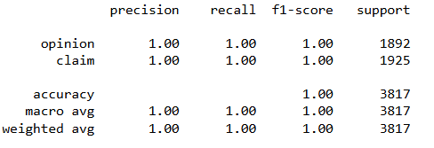

The classification report above shows that the random forest model scores were nearly perfect. The confusion matrix indicates that there were 10 misclassifications — five false postives and five false negatives.

**XGBoost**

Now, I'll evaluate the XGBoost model on the validation set.

The XGBoost model also delivered nearly perfect results; however, its errors were primarily false negatives. Since identifying claims is the priority, it is crucial for the model to excel at capturing all actual claim videos. The random forest model demonstrated a higher recall score and is, therefore, the selected champion model.

**Use Champion Model to Predict on Test Data**

Both the random forest and XGBoost model architectures resulted in nearly perfect models. Nonetheless, in this case, the random forest model performed a little bit better, so it is the champion model.

Now, I'll use the champion model to predict on the test data.

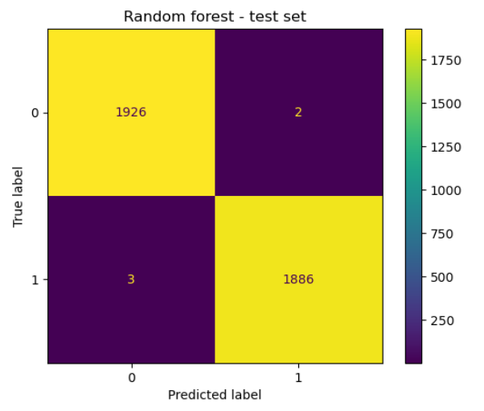

**Feature Importances of Champion Model**

The most predictive features were all associated with the engagement levels generated by the video. This aligns with expectations, as insights from the earlier exploratory data analysis (EDA) indicated a similar pattern.

**Conclusion**

- Would I recommend using this model? Why or why not?
  Yes, I will recommend this model because it performed well on both the validation and test holdout data. Furthermore, both precision and F1 scores were consistently high. The model very successfully
  classified claims and opinions.
- What was the model doing? How was it making predictions?
  The model's most predictive features were all related to the user engagement levels associated with each video. It was classifying videos based on how many views, likes, shares, and downloads they received.
- Are there new features that can be engineered that might improve model performance?
  Because the model currently performs nearly perfectly, there is no need to engineer any new features.
- What features are good to have that would likely improve the performance of the model?
  The current version of the model does not need any new features. However, it would be helpful to have the number of times the video was reported. It would also be useful to have the total number of user
  reports for all videos posted by each author.

